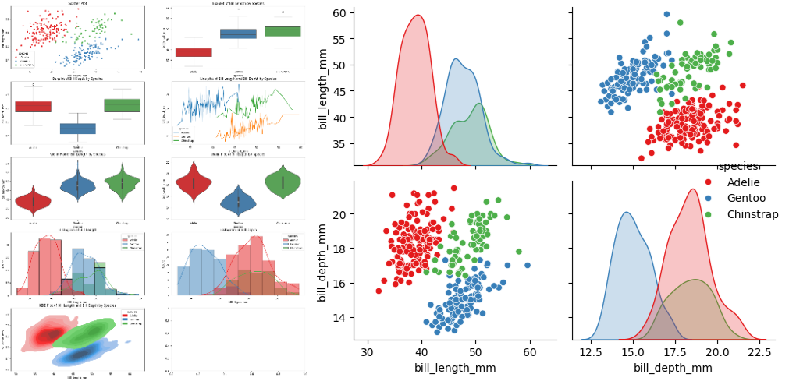

# RandomWalk Data Science Assessment

## Instructions:

1) Fork the github repo into your personal Github account and take a clone into your local system.

   Guide to Forking Github Repo: https://docs.github.com/en/github-ae@latest/get-started/quickstart/fork-a-repo

   Guide for cloning Github Repo: https://docs.github.com/en/repositories/creating-and-managing-repositories/cloning-a-repository

2) Intantiate a Jupyter Notebook instance in the local working directory and create a notebook which answers the following questions.

   Guide for installing Jupyter Notebook in Local system: https://test-jupyter.readthedocs.io/en/latest/install.html

3) Save the notebook and push it into forked Github github repo.

   Guide to pushing code into Github Repo: https://docs.github.com/en/migrations/importing-source-code/using-the-command-line-to-import-source-code/adding-locally-hosted-code-to-github
   
4) Record a screencast video recording demonstrating the solution in your system and upload the video into the forked github repo.

   Guide to record screen in

   a) MAC: https://support.apple.com/en-in/102618

   b) Windows: https://www.microsoft.com/en-us/windows/learning-center/how-to-record-screen-windows-11

   c) Ubuntu: https://askubuntu.com/questions/4428/how-can-i-record-my-screen
   
5) Share the repository link into the Google Form: https://forms.gle/QCfjjyQQ5jnoegNe9

## Questions:

Q1: Identify missing or incorrect data in the dataset and apply appropriate preprocessing steps to clean it (code and explanation)

Q2: What is the average body_mass_g for Gentoo penguins? (code)

Q3: How do the distributions of bill_length_mm and bill_depth_mm differ between the three penguin species? Analyze the skewness and kurtosis of each feature for different species. (code and explanation)

Q4: Identify which features in the dataset have outliers. Provide the method used to detect them and visualize the outliers. (code and explanation)

Q5: Does this dataset contribute to the curse of dimensionality? If yes perform PCA. (code and explanation required)

Q6: Use bill_length_mm vs bill_depth_mm and plot 7 different graphs to visualize them. (code)

Q7: Find the maximum flipper_length_mm for each combination of species and island. Which species has the longest flippers on each island? (code)

Q8: Perform z-score normalization on this dataset. (code)

